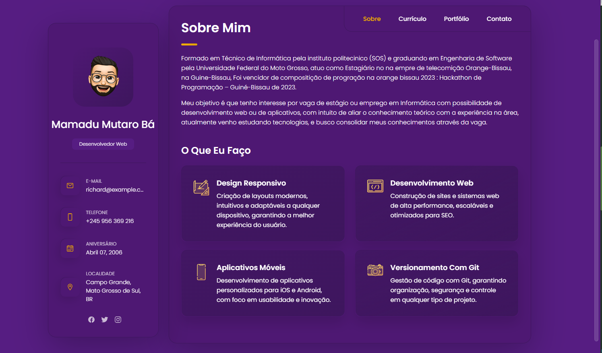
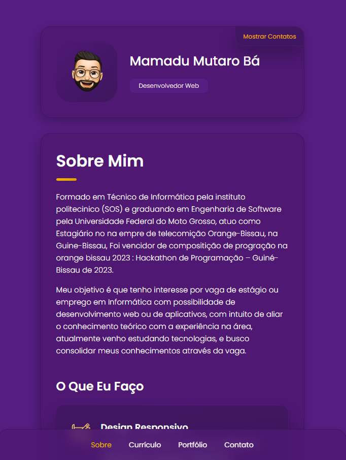

# vCard - Portfólio pessoal


[](https://twitter.com/intent/follow?screen_name=codewithsadee_)
[](https://youtu.be/SoxmIlgf2zM)

vCard é um site de portfólio pessoal totalmente responsivo para todos os dispositivos, construído com HTML, CSS e JavaScript.

## Demonstração




## Pré-requisitos

Antes de começar, certifique-se de que você atendeu aos seguintes requisitos:

* [Git](https://git-scm.com/downloads "Download Git") deve estar instalado no seu sistema operacional.

## Instalando vCard

Para instalar o **vCard**, siga estas etapas:

Linux e macOS:

```bash
sudo git clone https://github.com/codewithsadee/vcard-personal-portfolio.git
```

Windows:

```bash
git clone https://github.com/codewithsadee/vcard-personal-portfolio.git
```

## Contato

Se quiser entrar em contato comigo, você pode me encontrar no [Twitter](https://www.twitter.com/codewithsadee).

## Licença

MIT

